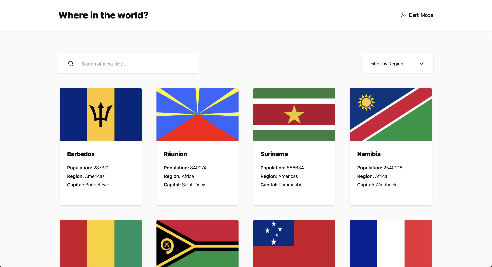

# REST Countries API with color theme switcher

[Frontend Mentor](https://www.frontendmentor.io/challenges/rest-countries-api-with-color-theme-switcher-5cacc469fec04111f7b848ca)

[Live](https://rest-countries-hg.netlify.app/)



## Usage

Install dependencies

```bash
npm install
```

To run vite local server type in the console

```bash
npm run dev
```
